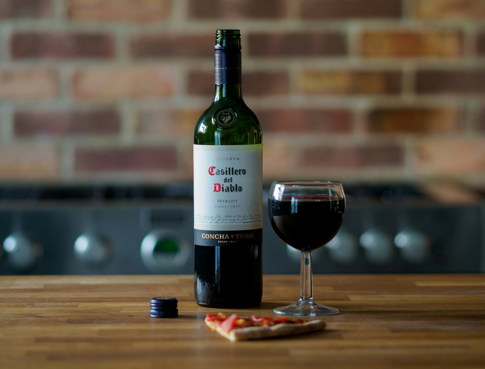

# Red Wine Quality: Clustering

This [dataset](https://archive.ics.uci.edu/dataset/186/wine+quality) is related to red variants of the Portuguese "Vinho Verde" wine. Due to privacy and logistic issues, only physicochemical (inputs) and sensory (the output) variables are available (e.g. there is no data about grape types, wine brand, wine selling price, etc.).